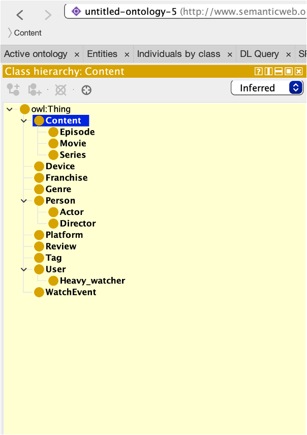
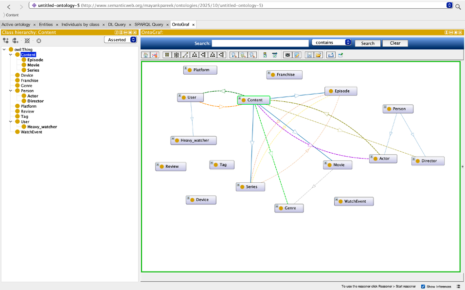
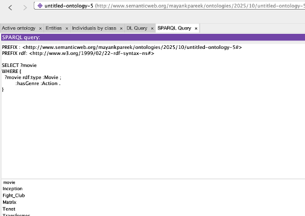

# Semantic Content Recommendation using Ontologies and LLMs

An investigative case study demonstrating how **ontologies** support semantic reasoning, explainability, and structured recommendation in streaming platforms, and how they complement **Large Language Models (LLMs)** in hybrid AI systems.

---

## 📌 Project Overview

Modern streaming platforms rely heavily on metadata-driven recommendation systems.  
However, inconsistent tagging, lack of semantic structure, and black-box ML models reduce explainability and trust.

This project explores how **ontology-based knowledge representation** can address these issues by enabling:
- Logical consistency
- Semantic reasoning
- Explainable recommendations

The ontology is designed for a **Netflix-like streaming platform** and evaluated using reasoning and SPARQL queries.

---

## 🎯 Objectives

- Design a domain ontology for streaming content metadata
- Model genres, content, actors, users, and relationships
- Apply Description Logic constraints and axioms
- Validate consistency using automated reasoning
- Demonstrate recommendation use cases via SPARQL
- Analyse how ontologies complement LLM-based systems

---

## 🏗️ Ontology Design

### Core Concepts
- **Content** (Movie, Series, Episode)
- **Genre**
- **Actor / Director**
- **User**
- **Franchise**

### Key Relationships
- `hasGenre`
- `hasActor`
- `directedBy`
- `partOfSeries`
- `watched`

The ontology is implemented in **OWL 2 DL** using Protégé and supports reasoning and inference.

---

## 🧠 Reasoning & Inference

- Logical consistency verified using **HermiT reasoner**
- Disjoint classes (e.g., Movie vs Series) validated
- Automatic inference of subclass and relationship structure

---

## 🔍 SPARQL-Based Recommendation Use Cases

Example queries include:
- Retrieve all movies of a specific genre
- List actors associated with a movie
- Retrieve all movies of sci-fi genre

These queries demonstrate how semantic reasoning supports explainable recommendations.

---

## 🤖 Ontology + LLM Integration

This project analyses how ontologies complement LLMs by:
- Providing semantic grounding
- Enforcing logical constraints
- Reducing hallucination risks
- Improving explainability in hybrid AI pipelines

---

## 🖼️ Screenshots

### Ontology Class Hierarchy (Protégé)

### Inferred Hierarchy after Reasoning

### SPARQL Query Results

---

## 📁 Repository Structure

ontology/ → OWL/Turtle ontology
sparql/ → SPARQL queries
report/ → Full investigative report
screenshots/ → Ontology visualisations

---

## 🧪 Tools & Technologies

- Protégé 5.x
- OWL 2 DL
- HermiT Reasoner
- SPARQL 1.1
- Semantic Web standards

---

## 👤 Author

**Mayank Pareek**  
MSc Artificial Intelligence  

GitHub: https://github.com/Mayank-Pareek30/semantic_recommendation_ontology

---

## 📚 References

Key academic and industry references are included in the full report.
